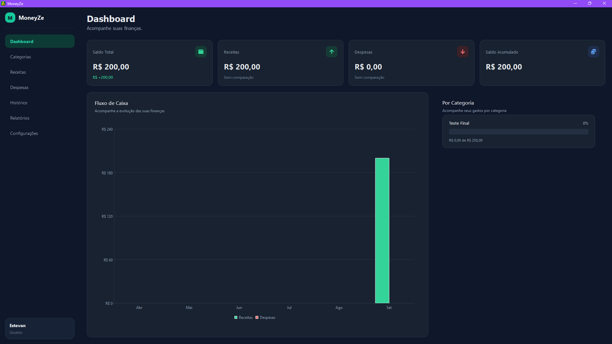
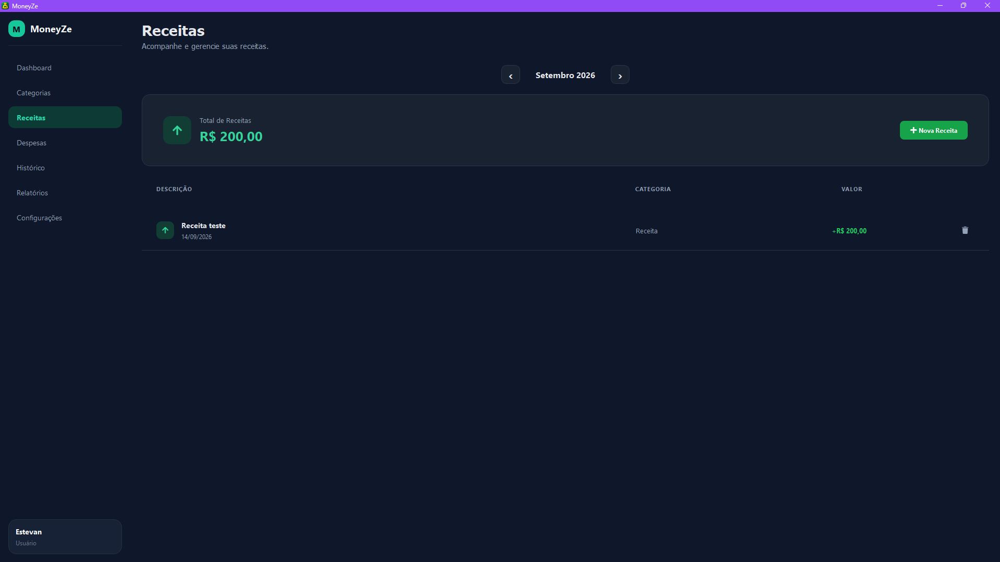
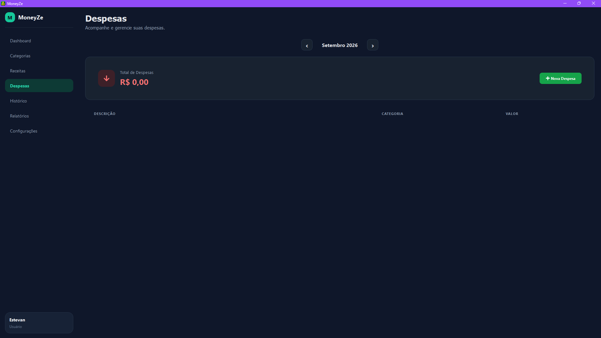
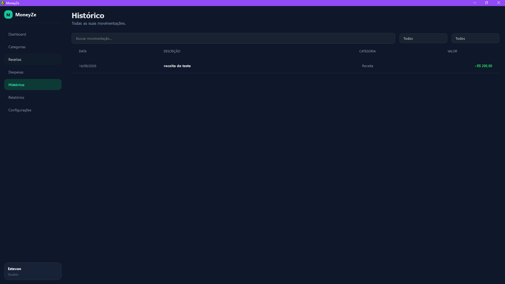
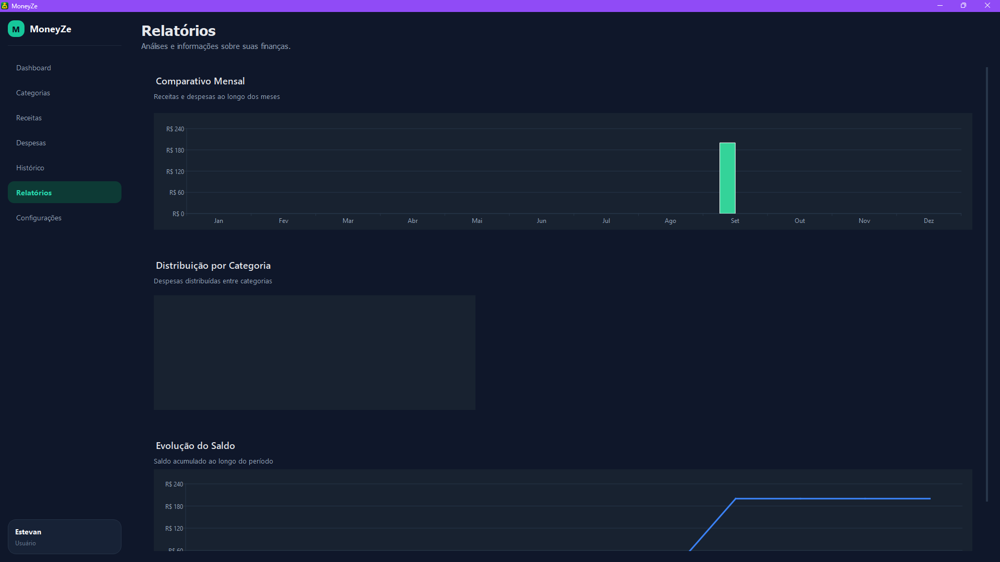
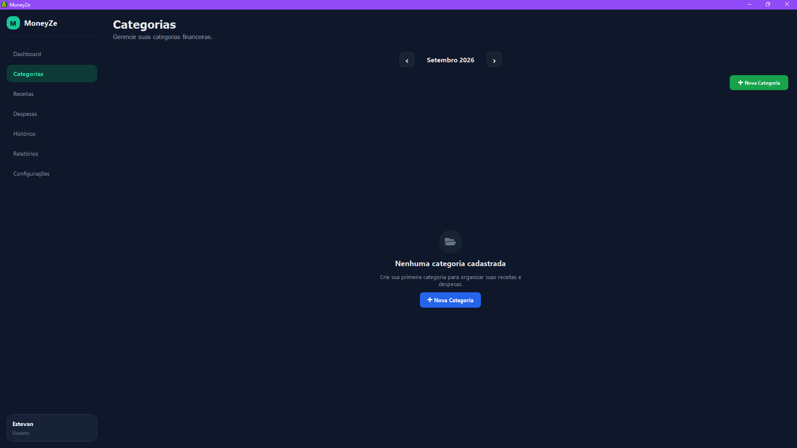
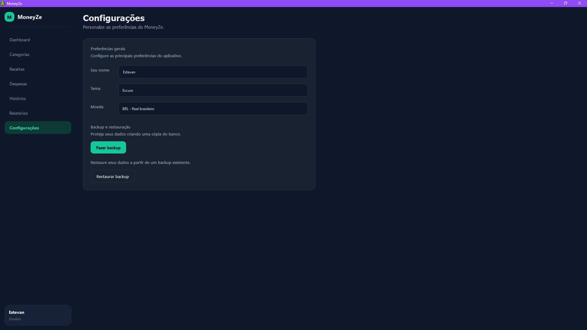

# 💰 MoneyZe


**MoneyZe** é uma aplicação desktop para gerenciamento financeiro pessoal, desenvolvida com Python e PySide6.

O objetivo do projeto é oferecer uma forma simples, organizada e intuitiva de acompanhar receitas, despesas, categorias e movimentações financeiras, utilizando uma interface desktop moderna e persistência local de dados.

O projeto também foi desenvolvido com foco em organização de código, separação de responsabilidades e aplicação de uma arquitetura em camadas.

---

## ✨ Funcionalidades

### 💰 Controle financeiro

- Cadastro de receitas
- Cadastro de despesas
- Classificação de despesas por categoria
- Histórico de transações
- Exclusão de transações
- Cálculo automático de receitas, despesas e saldo

### 📊 Dashboard

- Saldo total
- Total de receitas
- Total de despesas
- Saldo acumulado
- Fluxo de caixa
- Distribuição de despesas por categoria

### 📈 Relatórios

- Comparação mensal
- Distribuição de despesas por categoria
- Evolução do saldo
- Visualização gráfica dos dados financeiros

### 🗂️ Categorias

- Criação de categorias
- Visualização das categorias
- Exclusão de categorias sem transações vinculadas
- Proteção contra exclusão de categorias utilizadas

### ⚙️ Configurações

- Personalização do nome do usuário
- Tema claro
- Tema escuro
- Seleção de moeda
- Persistência das configurações

### 💾 Backup e restauração

- Criação de backup do banco de dados
- Validação de backups
- Restauração de dados
- Confirmação antes da restauração

### 🖥️ Aplicação desktop

- Interface desenvolvida com PySide6
- Navegação entre módulos
- Ícone personalizado
- Executável Windows gerado com PyInstaller

---

## 🛠️ Tecnologias

- **Python 3.13**
- **PySide6 6.11.1**
- **SQLAlchemy 2.0.51**
- **SQLite**
- **PyInstaller**
- **Git**
- **GitHub**

---

## 🏗️ Arquitetura

O MoneyZe utiliza uma arquitetura em camadas para separar responsabilidades e facilitar a manutenção do código.

```text
Views
  ↓
Services
  ↓
Repositories
  ↓
Models
  ↓
SQLite
```

### Views

Responsáveis pela interface gráfica e interação com o usuário.

```text
views/
```

### Services

Responsáveis pelas regras de negócio da aplicação.

```text
services/
```

### Repositories

Responsáveis pelo acesso e manipulação dos dados.

```text
repositories/
```

### Models

Representam as entidades utilizadas pela aplicação e seu mapeamento para o banco de dados.

```text
database/models/
```

### SQLite

Banco de dados local utilizado para persistência das informações.

---

## 📂 Estrutura do projeto

```text
MoneyZe/
│
├── assets/
├── components/
├── core/
├── data/
├── database/
│   └── models/
├── enums/
├── exceptions/
├── repositories/
├── services/
├── styles/
├── utils/
├── views/
├── app.py
├── requirements.txt
├── README.md
└── .gitignore
```

---

## 🚀 Instalação

### Pré-requisitos

- Python 3.13 ou superior
- Git

### 1. Clone o repositório

```bash
git clone <URL_DO_REPOSITORIO>
```

### 2. Acesse o projeto

```bash
cd moneyze
```

### 3. Crie um ambiente virtual

Windows:

```powershell
py -3.13 -m venv .venv
```

### 4. Ative o ambiente virtual

```powershell
.\.venv\Scripts\Activate.ps1
```

### 5. Instale as dependências

```powershell
pip install -r requirements.txt
```

### 6. Execute o MoneyZe

```powershell
python app.py
```

---

## 📦 Gerando o executável

O projeto utiliza o **PyInstaller** para gerar o executável do Windows.

Com o ambiente virtual ativado:

```powershell
pyinstaller --name MoneyZe --windowed --icon=assets\moneyze.ico --add-data "assets\moneyze.ico;assets" app.py
```

O executável será gerado em:

```text
dist/
└── MoneyZe/
    └── MoneyZe.exe
```

---

## 💾 Backup

O MoneyZe possui um sistema integrado de backup e restauração do banco de dados.

O backup pode ser criado diretamente pela aplicação através de:

```text
Configurações
    ↓
Backup e restauração
    ↓
Fazer backup
```

O arquivo gerado contém os dados do banco SQLite utilizados pelo aplicativo.

---

## 🔄 Restauração

Para restaurar um backup existente:

```text
Configurações
    ↓
Backup e restauração
    ↓
Restaurar backup
```

O MoneyZe valida o arquivo antes da restauração e solicita confirmação antes de substituir os dados atuais.

---

## 📷 Screenshots

As principais telas do MoneyZe serão apresentadas nesta seção.

### Dashboard



### Receitas



### Despesas



### Histórico



### Relatórios



### Categorias



### Configurações



---

## 📌 Versão

### MoneyZe v1.0.0

A versão **1.0.0** representa a primeira release estável do MoneyZe.

O projeto utiliza **Semantic Versioning**:

```text
MAJOR.MINOR.PATCH
```

Onde:

- **MAJOR** → mudanças maiores ou incompatíveis
- **MINOR** → novas funcionalidades compatíveis
- **PATCH** → correções e ajustes

Exemplos:

```text
v1.0.1 → correção de bugs
v1.1.0 → nova funcionalidade
v2.0.0 → mudança maior
```

---

## 🎯 Escopo do MVP

A versão 1.0.0 possui um escopo definido para gerenciamento financeiro pessoal.

### Incluído no MVP

- Controle de receitas
- Controle de despesas
- Categorias
- Histórico financeiro
- Dashboard
- Relatórios
- Configurações
- Backup e restauração
- Aplicação desktop

### Fora do MVP

As funcionalidades abaixo não fazem parte da versão 1.0.0:

- Edição de transações
- Gráficos avançados
- Sincronização em nuvem
- Integração bancária
- Aplicativo mobile
- Sistema multiusuário

---

## 🗺️ Roadmap

Possíveis evoluções futuras:

- [ ] Edição de transações
- [ ] Melhorias nos gráficos
- [ ] Exportação de dados
- [ ] Novas opções de relatórios
- [ ] Sincronização em nuvem
- [ ] Aplicativo mobile
- [ ] Sistema multiusuário

---

## 🧪 Testes

O MoneyZe passou por uma etapa de estabilização e testes envolvendo:

- Persistência de dados
- Receitas
- Despesas
- Categorias
- Histórico
- Dashboard
- Relatórios
- Cálculos financeiros
- Exclusão de transações
- Configurações
- Backup
- Restauração
- Execução através do `.exe`

---

## 👨‍💻 Autor

Desenvolvido por **Estevan Saldanha** como projeto de desenvolvimento e portfólio.

---

## 📄 Licença

Este projeto está licenciado sob a licença MIT.

Consulte o arquivo [LICENSE](LICENSE) para mais informações.
